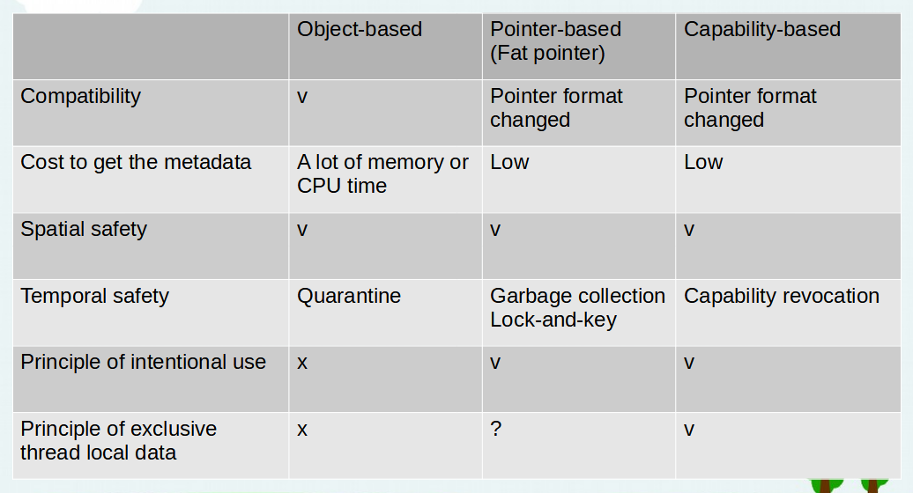
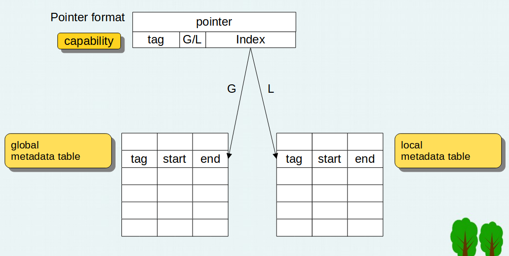

# Using capability to implement memory bounds checking
Generally speaking there are two ways to do memory bounds checking, the object-based approach and the pointer-based approach. 
Each has its advantages and disadvantages. In this article I propose a capability-based approach to do memory bounds checking.

The table below shows the comparison of these approaches.

Below is the format of the pointer for capability-based approach.

The advantages of capability-based approach are:
* The pointer is smaller than the fat pointer based approach
* The overhead to get the object metadata is very low
* It can detect temporal safety violation by using capability revocation
* When doing memcpy, there is no need to propagate the metadata for the pointers in the buffer since the metadata is in a spearate area
* It supports principle of intentional use
* It supports principle of exclusive thread local data

